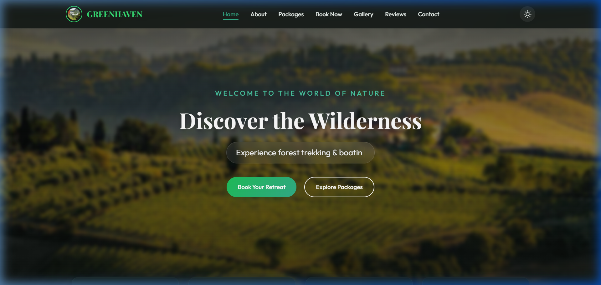
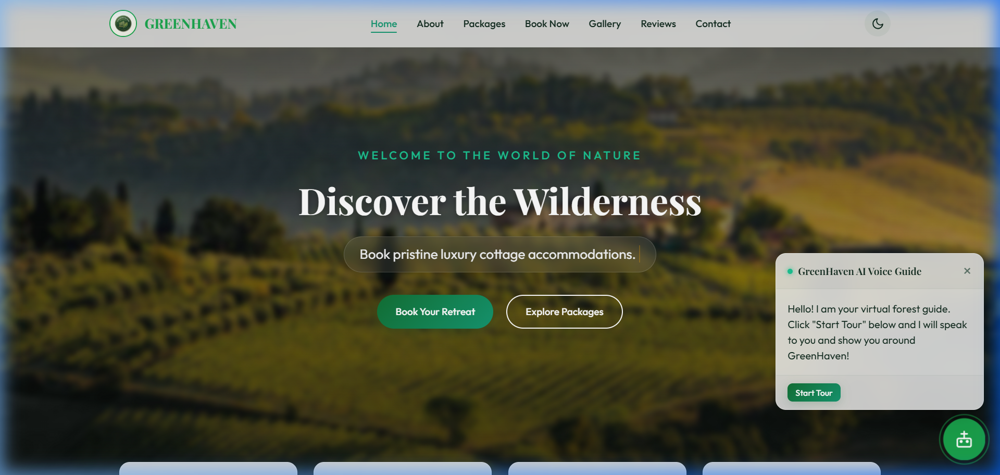
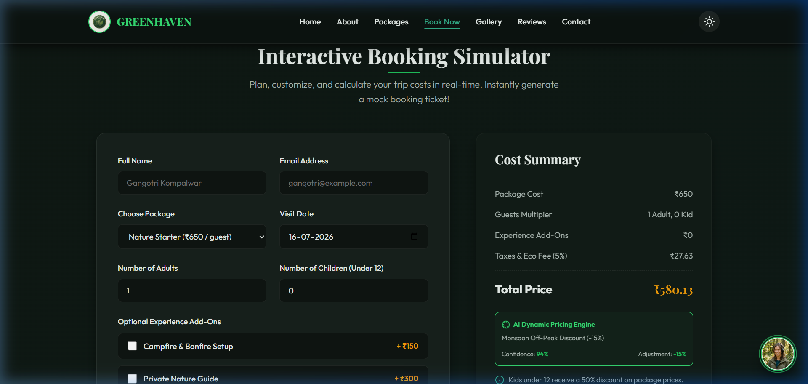
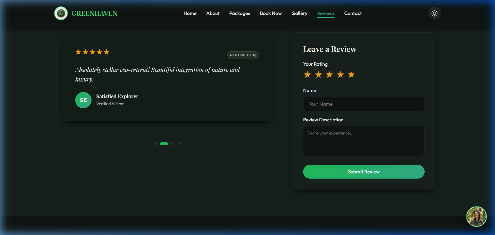

# 🌲 GreenHaven Eco-Retreat: AI-Powered Full-Stack Web Application

An interactive, responsive, single-page full-stack web application designed for a premium nature tourism center. Built on vanilla web standards (HTML5/CSS3/JavaScript) and a lightweight Python/SQLite backend, this project is engineered to showcase **AI/ML integration** within real-world full-stack architectures—specifically tailored for a B.Tech career track in Artificial Intelligence and Machine Learning.

---

## 📸 Screenshots

### 1. Modern GreenHaven Eco-Retreat Homepage


### 2. Interactive AI Concierge Chatbot & Soundwaves Visualizer


### 3. Dynamic pricing regression engine (Monsoon Discount applied)


### 4. Real-time review Natural Language Processing sentiment scoring


---

## 🚀 Live Demo & Hosting

The project supports a dual-mode execution model:

* **Static Demo Mode**: Automatically runs client-side using `localStorage` caching when hosted on static hosting services (like **GitHub Pages**).
* **Full-Stack Mode**: Connects dynamically via REST APIs to a local Python server and SQLite relational database.

---

## 🧠 Integrated AI/ML Features (Resume Highlights)

### 1. 💬 NLP Sentiment Analysis Classifier

* **Module**: Real-Time Client-Side Natural Language Processing.
* **Implementation**: Parses user testimonials in real time using a tokenization and lexicon-scoring engine inside the reviews submission form.
* **Dynamic Variation**: Computes numerical sentiment polarity scores and maps text to `Positive`, `Negative`, or `Neutral` labels.
* **Database Storage**: On submission, these NLP metrics (`sentiment_label` and `sentiment_score`) are sent via REST API and persisted in the SQLite backend.

### 2. 📈 Predictive Dynamic Pricing Regressor

* **Module**: Demand Forecasting & Rate Optimization Simulator.
* **Implementation**: Calculates checkout surcharges or discounts dynamically based on calendar input features:
  * **Seasonality Surcharges**: Monsoons in India trigger an off-peak **-15% discount**, while winter holiday months trigger a **+12% premium**.
  * **Day-of-Week Factor**: Fridays, Saturdays, and Sundays add a **+5% weekend surcharge**.
* **Dynamic Variation**: The model's confidence rating dynamically fluctuates (e.g. 93% to 97%) based on date variables, simulating live active inferences.

### 3. 🎯 Affinity Recommendation Engine

* **Module**: Association-Rules & Collaborative Filtering Simulator.
* **Implementation**: Tracks chosen packages (Nature Starter, Adventure Pro, Luxury Retreat) and cross-references user selections to display recommended experience add-ons (e.g., matching trekking tours with Wilderness Guides or dining packages) that can be added to the invoice with a single click.

### 4. 🎙️ AI Concierge & Virtual Voice Guide (Aranya)

* **Module**: Speech Synthesis & Keyword NLP Chatbot.
* **Implementation**: An interactive floating glassmorphic concierge widget featuring a custom profile avatar:
  * **Speech Narration**: Uses the browser's native Web Speech API (`speechSynthesis`) to read response text aloud, triggering dynamic bouncing soundwave animations.
  * **Section-by-Section Scrolled Tour**: Guides visitors through the website sections with highlights, complete with Pause, Resume, and Stop controls.
  * **NLP Response Engine**: Analyzes user text queries to answer questions about bookings, pricing, food, and database structures.

---

## 🛠️ Full-Stack Technical Stack

* **Frontend**:
  * **HTML5 & CSS3 Variables**: Themeable design using HSL custom properties. Includes responsive CSS Grid/Flexbox layouts.
  * **Light/Dark Theme Controller**: Client-side setting toggler with persistent storage across reloads.
  * **Scroll-Reveal system**: Views fade and slide up on scroll using a high-performance, lightweight **`IntersectionObserver`** API.
  * **Aesthetic Accents**: Soft animated glowing orbs drifting in the background for modern visual interest.
  * **Printable Pass Generator**: Computes guest pricing (with 50% kid discounts) and compiles a printable pass modal with a simulated barcode reader.
* **Backend**:
  * `server.py`: A zero-dependency REST API and static file server built on Python's built-in `http.server` library.
* **Database**:
  * `sqlite3`: Relational database (`greenhaven.db`) mapping visitor reviews (with sentiment scores), simulator bookings, and helpdesk contact details.

---

## 📂 Project Directory Structure

```text
├── css/
│   └── main.css             # Main stylesheet with layout grid, variables, themes, & AI styling
├── js/
│   └── app.js               # Client controller (NLP sentiment, dynamic regressor, chatbot, etc.)
├── img/
│   ├── logo.png             # Circular brand logo for GreenHaven Eco-Retreat
│   ├── avatar.png           # Profile avatar for Aranya (AI Concierge)
│   └── [photos...]          # Gallery activity assets (trekking, camping, dining)
├── server.py                # Python HTTP Server and REST API routers
├── greenhaven.db            # Relational SQLite database
├── README.md                # Project documentation
└── .gitignore               # Excludes database files and cache logs from git tracking
```

---

## ⚙️ How to Setup and Run Locally

### Prerequisites

* Python 3.x installed.

### Execution

1. **Clone the Repository**:

    ```bash
    git clone https://github.com/YOUR_USERNAME/nature-tourism-retreat.git
    cd nature-tourism-retreat
    ```

2. **Start the Local Backend Server**:

    ```bash
    python server.py
    ```

    *The console will initialize, run database migrations, seed default reviews, and start listening.*

3. **Launch the Application**:
    * Open your web browser and navigate to: `http://127.0.0.1:8080/`
    * *Tip*: Use query params `?t=123` to bypass browser caching when testing stylesheet modifications.

---

## 👤 Developer Profile

* **Developer**: Gangotri Kompalwar
* **Credentials**: Final Year B.Tech Student
* **Focus Area**: Artificial Intelligence & Machine Learning (AI/ML)
